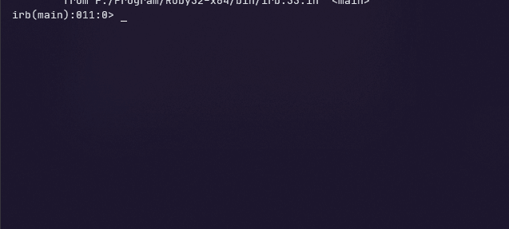
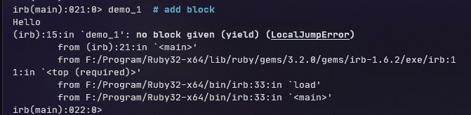

# Start with Ruby

## Introduction

Ruby is an open source programming language with a focus on simplicity and productivity.

Here are some main features of Ruby :

- Ruby is open-source and is freely available on the Web, but it is subject to a license
- Ruby is a server-side scripting language similar to Python and PERL
- Ruby is very much scalable
- Big programs written in Ruby are easily maintainable
- Ruby can be used for developing Internet and intranet applications
- Ruby can be embedded into Hypertext Markup Language (HTML)

You'll find here some examples of using Ruby for my personnal use and test.

Hope it can help :)

## Summary

- [Tools and version](#tools-and-versions)
- Test files :

  - [Requirements and Makefile usage](#requirements-and-makefile-usage)
  - [Simple tuto](#simple-tuto)
  - [Ask a question](#ask-a-question)
  - [Examples](#examples)
  - [Some tips](#tips)

- Useful resources :

  - [Reserved word](#reserved-words)
  - [Keywords and methods](#keywords-and-methods)

- [Sources](#sources)

## Tools and versions

- OS
  Kali Linux OS - Ruby v3.1.2
  Windows OS - Ruby v3.2.2

- IDE
  VSCodium v1.77.1

## Test files

### Requirements and Makefile usage

Considering you already have Ruby on your host machine, you can use make to read any file inside this repo

```sh
make run FILE=[name of file]
```


### Simple tuto

`tuto.rb` is a simple ruby tutorial

### Ask a question

`ask-question.rb` use the method `gets` and `chomp`

When you enter your word, you'll see that your sentence is broken down into two lines and chomp can remove "\n" from the answer.

### Examples

Launch an example :

```sh
make run_example FILE=example_1
```

- example_1: convert the answer from string to number and test if the number is even, conditions
- example_2: Guess the number, comparison
- example_3: Is the word a palindrom ?
- example_4: array
- example_5: Hash and Hash class
- example_6: Symbols
- example_7: Loop, guess again the number WHILE loop
- example_8: Loop, guess again the number FOR loop, each for arrays and hash
- example_9: Loop, iterator LOOP BREAK
- example_10: Frequency of a word
- example_11: Methods
- example_12: Block & proc

## Tips

- Antoher way to create an array of string

```rb
%w{apple pear fig} => ["apple", "pear", "fig"] # shortcut
```

- respond_to?(:method_name) => let you check if the value given can be used for the method, give a boolean value

## Useful Resources

### Reserved Words

The following list shows the reserved words in Ruby.
These words may not be used as constant or variable names.


### Keywords and methods

Single line comment:

```rb
# This is a comment
```

Block comment

```rb
=begin
This is a comment
And another line
And another comment
=end
```

Create method

```rb
def method_name
    code
end

#with parameters
def method_name(params)
    code
end
```

Variables

```rb
varname = "Hello"
```

Conditions

```rb
&& # AND
|| # OR
! # reverse everything after
```

Conventions

```rb
method? # the ? gives a boolean
varname! # the ! indicate that value is modified
```

Convert

```rb
to_i # convert to integer
to_s # convert to string
```


Insert value

```rb
# same result
"Hello" + "World" => "Hello" << "World"
```



Block

```rb
def demo_1
  puts "Hello"
  yield # add the block "How are you?"
  puts "Bye bye"
end

demo_1 { puts "How are you?" } # you have to add a block with yield keyword
```

Error in case you didn't add block:



Proc

```rb
proc_name = Proc.new { ...code }

method_name(other_params, &proc_name)

# the & is for casting the new proc into block

```

## Sources

- [Features](https://www.tutorialspoint.com/ruby/ruby_overview.htm#:~:text=Features%20of%20Ruby,similar%20to%20Python%20and%20PERL.)

- [Reserved words](https://www.tutorialspoint.com/ruby/ruby_syntax.htm)
